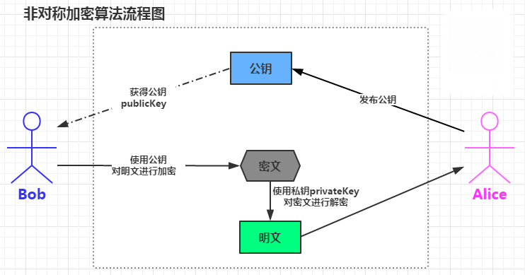

# RSA 非对称加密算法

### 什么是RSA？
> - RSA加密算法是一种非对称加密算法。在公开密钥加密和电子商业中RSA被广泛使用。
RSA是1977年由罗纳德·李维斯特（Ron Rivest）、阿迪·萨莫尔（Adi Shamir）
和伦纳德·阿德曼（Leonard Adleman）一起提出的。当时他们三人都在麻省理工学院工作。
RSA就是他们三人姓氏开头字母拼在一起组成的。
> - 主要组成： 公钥和私钥


### 为什么使用RSA？

```sh
    通讯       通讯
A ======== B ======== c
```

A 想和 C 通信，但他们中间总是隔着 B，A 发给 C 的内容必须经 B 传递,就可能出现的问题：
1. B 能看到 A 发给 C 的内容。
2. B 可以伪造 A 发给 C 的内容。

解决方案：对消息进行加密。    
加密方式：分为对称加密，和非对称加密。

#### 使用对称加密的局限性
- 过于依赖 A和C 的单独通讯，容易泄露加密方式

### 使用非对称加密算法RSA
- 公钥：用于公布给所有人，加密消息
- 私钥: 用于解密消息

```sh
            通讯        通讯
A（私钥） ========= B ========= C（公钥加密消息）
          公开公钥     公开公钥
```
 

### RSA 数学证明

### 数学基础
- 同余： 两个整数除以同一个整数，若得相同余数，则二整数同余,符号≡。例如21 ≡ 51 (mod 10)
- 素数（质数）：素数又称质数，指在一个大于1的自然数中，除了1和此整数自身外，不能被其他自然数整除的数。
- 若N个整数的最大公因子是1，则称这N个整数互质。
  1. 两个不同的质数一定是互质数。例如，2与7、13与19。
  2. 一个质数，另一个不为它的倍数，这两个数为互质数。例如，3与10、5与 26。
  3. 相邻的两个自然数是互质数。如 15与 16。
  4. 相邻的两个奇数是互质数。如 49与 51。
  5. 较大数是质数的两个数是互质数。如97与88。
  6. 小数是质数，大数不是小数的倍数的两个数是互质数。例如 7和 16。
  7. 2和任何奇数是互质数。例如2和87。
  8. 1不是质数也不是合数，它和任何一个自然数在一起都是互质数。如1和9908。
- 指数运算: n^m, n称为“底数”，m称为“指数”
- 模运算: 也叫余数
- 同余运算：两个整数a，b，若它们除以正整数m所得的余数相等，则称a，b对于模m同余，记作: a ≡ b (mod m)；读作：a同余于b模m，或者，a与b关于模m同余。例如：26 ≡ 14 (mod 12)、 3 ≡ 27 (mod 12)
- 欧拉函数：  欧拉函数是求小于x并且和x互质的数的个数。其通式为：φ(x) = x(1-1/p1)(1-1/p2)(1-1/p3)(1-1/p4)…..(1-1/pn)
  - x = 16，那么x的所有质因数为：φ(16) = 16 * (1 - 1/2) = 8，与16互质的数：1, 3, 5, 7, 9, 11, 13, 15
  - x = 15，那么x的所有质因数为：φ(16) = 16 * (1 - 1/3)* (1 - 1/5) = 8，与15互质的数：1,2,4,7,8,11,13,14

- 特殊的欧拉函数：    

  0. 当n为质数的时候， p = n , φ(p) = φ(n) = n - 1    
  1. 质数n,m和 p = n*m,推导出 φ(p) = φ(n) * φ(M) = ( n-1 ) * ( m -1)
  2. 诺p = n^m, 则c除了n的倍数以外都是p的质数， φ(p) = n^m - n^(m-1) = (n-1) * n^(m-1)。例如： φ(81) = 3^4 = (3 -1 ) * 3 ^(4-1) = 2 * 27 = 54
  3. 当 n 是基数的时候 p = 2n，  φ(p) =  φ(2n) = φ(n). 例如 φ(6) = φ(3) = 2
  4. [其他详细](http://blog.csdn.net/wangjian8006/article/details/7833319)
  5. 最为重要的是第二条，其证明，需要用到["中国剩余定理"](https://zh.wikipedia.org/wiki/%E4%B8%AD%E5%9B%BD%E5%89%A9%E4%BD%99%E5%AE%9A%E7%90%86)

- 欧拉定理： 欧拉函数的作用于证明欧拉定理的，[证明](https://zh.wikipedia.org/wiki/%E6%AC%A7%E6%8B%89%E5%AE%9A%E7%90%86_(%E6%95%B0%E8%AE%BA))，存在正整数a和n互质，公式：a^φ(n) ≡ 1 (mod n),当n为质数的时候，根据欧拉函数 φ(n) = n - 1, a^φ(n) = a^(n-1) ≡ 1 (mod n)。    
例如：   
若n,a为正整数，且n,a互质，    
a = 3，n = 5, 存在 3^4 = 81≡ 1 mod 5 
a = 5, n = 6 , 5^φ(6) = 25 ≡ 1 mod 6

- 费马小定理: 是欧拉定理的特殊情况，φ(n)是质数，p = φ(n),假如a是一个整数，a^(p-1) ≡ 1 (mod p )一定成立    
例如：
若n,a为正整数，且n,a互质， 且 n 为质数     
a=4, n = 3, 4^(3 -1 ) = 16 ≡ 1 (mod 3)    
a=2, n = 7, 2^(7 -1 ) = 64 ≡ 1 (mod 7)    

- 模反定理：如果两个正整数a和n互质，那么一定可以找到整数b，使得 ab-1 被n整除，或者说ab被n除的余数是1。例如：    
a=5, n=9, 5b = 1 mod 9, 必定存在 b=16使其成立    
a=7, n=3, 7b = 1 mod 3, 必定存在 b=5使其成立    

### RSA的原理
RSA算法可归纳:

```sh

密文＝明文 ^ E mod N
公钥＝(E,N)
c ≡ m^e (mod n)

# RSA加密是对明文的E次方后除以N后求余数的过程
````

```sh

明文＝密文 ^ D mod N
私钥＝(D,N)
m ≡ c^d (mod n)

# 密文进行D次方后除以N的余数就是明文，这就是RSA解密过程

````
<em>所以整个RSA算法的核心就是根据E,N求解D的过程</em>
#### 开始算法：
- 第一步，随机选择两个不相等的质数p和q。p=61,q=53
- 第二步，计算p和q的乘积n。　n = 61×53 = 3233
  - n的长度就是密钥长度。3233写成二进制是110010100001，一共有12位，所以这个密钥就是12位。实际应用中，RSA密钥一般是1024位，重要场合则为2048位。
- 第三步，计算n的欧拉函数φ(n)。 φ(n) = (p-1)(q-1) = 3120。
- 第四步，随机选择一个整数e，条件是1< e < φ(n)，且e与φ(n) 互质。e = 17 (实际应用中，常常选择65537）
- 第五步，计算e对于φ(n)的模反元素d:
  - ed ≡ 1 (mod φ(n))
  - ed - 1 = kφ(n)   =>   ed - kφ(n) = 1
  - ex + φ(n)y = 1  =>  已知 e=17, φ(n)=3120
  - 17x + 3120y = 1 => 这个方程可以用[扩展欧几里得算法](https://zh.wikipedia.org/wiki/%E6%89%A9%E5%B1%95%E6%AC%A7%E5%87%A0%E9%87%8C%E5%BE%97%E7%AE%97%E6%B3%95)求解
  - 解得一组：(x,y)=(2753,-15)
- 第六步，将n和e封装成公钥，n和d封装成私钥。
  - n=3233，e=17，d=2753
  - 所以公钥就是 (n, e) = (3233,17)
  - 私钥就是 (n, d) = （3233, 2753)

- 七、RSA算法的可靠性:回顾上面的密钥生成步骤，一共出现六个数字
  - p ：用于初始化的质数
  - q ：用于初始化的质数
  - n ：n = p * q
  - φ(n): φ(n) = (p-1)(q-1)
  - e : 随机选择一个整数e，条件是1< e < φ(n)，且e与φ(n) 互质。
  - d : ed ≡ 1 (mod φ(n)) 计算得到的    

<em>这六个数字之中，公钥用到了两个（n和e），其余四个数字都是不公开的。其中最关键的是d，因为n和d组成了私钥，一旦d泄漏，就等于私钥泄漏。</em>

#### 那么，有无可能在已知n和e的情况下，推导出d？
1. ed≡1 (mod φ(n))。只有知道e和φ(n)，才能算出d。
2. φ(n)=(p-1)(q-1)。只有知道p和q，才能算出φ(n)。
3. n=pq。只有将n因数分解，才能算出p和q。
#### 结论：如果n可以被因数分解，d就可以算出，也就意味着私钥被破解。
> 大整数的因数分解，是一件非常困难的事情。目前，除了暴力破解，还没有发现别的有效方法    

例如：    
你可以对3233进行因数分解（61×53），但是你没法对下面这个整数进行因数分解：

```sh
　 12301866845301177551304949
　　58384962720772853569595334
　　79219732245215172640050726
　　36575187452021997864693899
　　56474942774063845925192557
　　32630345373154826850791702
　　61221429134616704292143116
　　02221240479274737794080665
　　351419597459856902143413
```
他是下面两个质数的乘积：
```sh
　　33478071698956898786044169
　　84821269081770479498371376
　　85689124313889828837938780
　　02287614711652531743087737
　　814467999489
　　　　×
　　36746043666799590428244633
　　79962795263227915816434308
　　76426760322838157396665112
　　79233373417143396810270092
　　798736308917
```
这大概是人类已经分解的最大整数（232个十进制位，768个二进制位）。比它更大的因数分解，还没有被报道过，因此目前被破解的最长RSA密钥就是768位。
### 加密和解密
> 公钥:（n =3233, e=17） 、 私钥：（n=3233, d=2753）， m = 65: 明文， c = 2790: 密文
#### 加密
```sh

m^e ≡ c (mod n)

# 假设 m = 65, 计算得 c = 2790
```
#### 解密
```sh

c^d ≡ m (mod n)

# 假设 c =  2790, 计算得 m = 65
```
至此，"加密--解密"的整个过程全部完成。

#### 公钥(n,e) 只能加密小于n的整数m，那么如果要加密大于n的整数，该怎么办？
有两种解决方法：
- 一种是把长信息分割成若干段短消息，每段分别加密
- 一种是先选择一种"对称性加密算法"（比如DES，MD5），用这种算法的密钥加密信息，再用RSA公钥加密DES密钥。

文献参考：
- 维基百科：
[欧拉函数](https://zh.wikipedia.org/wiki/%E6%AC%A7%E6%8B%89%E5%87%BD%E6%95%B0) 
[欧拉定理](https://zh.wikipedia.org/wiki/%E6%AD%90%E6%8B%89%E5%AE%9A%E7%90%86)
[扩展欧几里得算法](https://zh.wikipedia.org/wiki/%E6%89%A9%E5%B1%95%E6%AC%A7%E5%87%A0%E9%87%8C%E5%BE%97%E7%AE%97%E6%B3%95)
- 阮一峰教程： [RSA算法原理（一）](http://www.ruanyifeng.com/blog/2013/06/rsa_algorithm_part_one.html)
[RSA算法原理（二）](http://www.ruanyifeng.com/blog/2013/07/rsa_algorithm_part_two.html)
- 其他 [轻松学习RSA加密算法原理](http://blog.csdn.net/sunmenggmail/article/details/11994013)